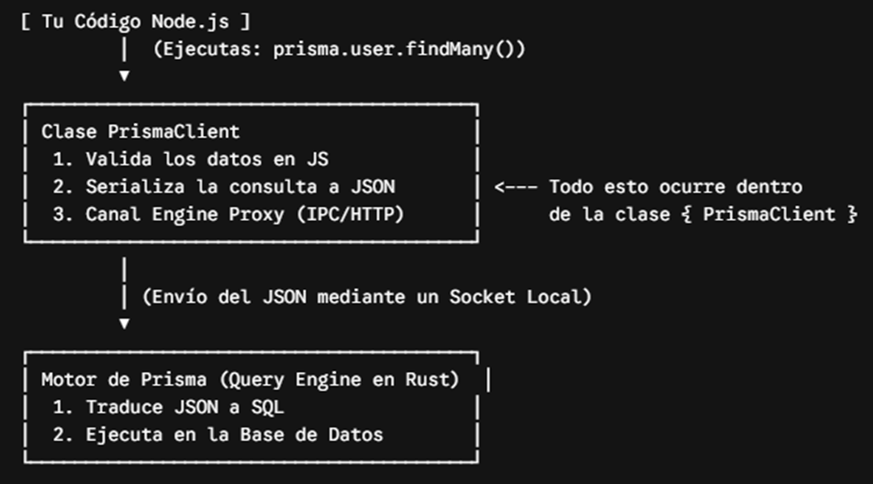
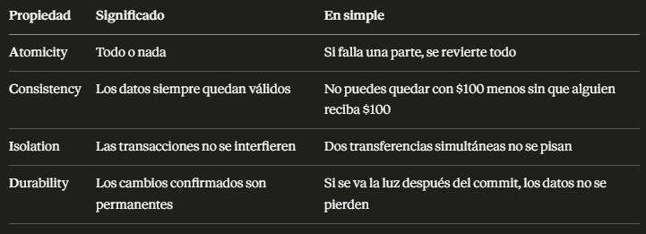

# Documentación de comandos del cliente de prisma
```
const {PrismaClient} = require('@prisma/client')
```
Este comando nos ayudara a importar solo la clase PrismaClient() gracias al destructuring { }. Esa clase hara lo siguiente:



Sin embargo, como es una clase (un plano) vamos a necesitar crear un objeto que vuelva funcional a esa clase para que la podamos usar cuando la necesitemos:
```
const prisma = new PrismaClient()
```

## Funciones asíncronas
Una función asíncrona es un bloque de codigo diseñado para ejecutarse en segundo plano sin detener (bloquear) el resto del programa. A diferencia de las funciones tradicionales, permite continuar con otras tareas mientras se procesan operaciones lentas, mejorando enormemente la fluidez y el rendimiento de las aplicaciones.
En nuestro caso este tipo de función nos ayudará mucho porque, como estamos ejecutando codigo del cliente de Prisma, este cliente tiene que hacer una serie de procesos (como está en la foto) para poder finalizar la función.

### Veamos algunos componentes de estas funciones:
- await: Pausa la ejecución de la función asíncrona hasta que la tarea pendiente (una promesa) termine y devuelva su resultado.
Mientras esa función específica se "detiene" a esperar, el resto del programa no se congela; el sistema operativo o el navegador continúa ejecutando otras tareas de la aplicación. Además, permite manejar los fallos de la operación asíncrona usando bloques tradicionales de control de errores (try/catch).

- try/catch: Sirve para manejar errores en el código y evitar que una aplicación se detenga o se "caiga" por completo cuando algo sale mal. 
- try (Intentar): Envuelve el bloque de código que sospechas que podría fallar (como una petición de red, leer un archivo o procesar datos que introduce un usuario).
- catch (Capturar): Es el bloque de emergencia. Si algo falla dentro del try, la ejecución normal se detiene inmediatamente y el control pasa al catch, que recibe un objeto con los detalles del error para que puedas gestionarlo. Ejemplo:

```
async function obtenerRutaWeb(req, res) {
    try {
        const datos = await prisma.usuario.findUnique({...});
        res.json(datos);
    } catch (error) {
        res.status(500).send("Error en el servidor");
    }
} // Capturas el error dentro de la función ya que necesitaras el objeto de respuesta (res) para avisarle al usuario que algo falló.

```

Sin embargo, en muchas funciones con scripts independientes, podemos simplicar el proceso de esta manera:
```
async function main() {
    const usuariosYPedidos = await prisma.usuario.findUnique({
        where: {id:1},
        include: {pedidos: true} 
    })
    console.log(JSON.stringify(usuariosYPedidos));  
}

main()
    .catch(console.error)
    .finally(() => prisma.$disconnect())
```

En este caso ponemos el catch (capturamos el error) a toda la función y nos ahorramos algunas líneas de código.

- .finally(): Es un bloque de código que se ejecuta siempre, sin importar si la promesa terminó bien o mal (error). Funciona como una garantía de limpieza: su único objetivo es ejecutar código de cierre o mantenimiento que debe completarse en cualquier escenario posible. Ejemplo:
Cerrar conexiones: Desconectarse de bases de datos (como el prisma.$disconnect()). Al poner prisma.$disconnect() dentro de .finally(), estás asegurando que tu aplicación cierre de forma obligatoria la conexión con la base de datos, sin importar si tus consultas tuvieron éxito o fallaron. Cuando ejecutas una consulta (como tu prisma.usuario.findUnique), Prisma abre una puerta de comunicación (un canal o "pool" de conexiones) hacia tu base de datos. Si todo sale bien: El código ejecuta tus consultas y, al terminar, el .finally() cierra esa puerta. Si el código falla (por ejemplo, error de sintaxis o ID inválido): El programa salta al .catch(), pero el .finally() sigue ejecutándose y cierra la puerta de todos modos.

## Métodos del Prisma Client más usados
Son las funciones de JavaScript que utilizas en tu día a día para interactuar con los datos. Se clasifican según su función:

### Buscar Datos (lectura)
findUnique(): Busca un único registro mediante un campo único (como el id o el email). Ejemplo:
```
await prisma.usuario.findUnique({ where: { id: 1 } })
```

findFirst(): Devuelve el primer registro que coincida con los criterios de búsqueda. Ejemplo:
```
await prisma.usuario.findFirst({ where: { nombre: 'Carlos' } })
```

findMany(): Trae una lista con todos los registros que cumplan las condiciones. Si lo dejas vacío, trae toda la tabla. Ejemplo:
```
await prisma.usuario.findMany({ where: { activo: true } })
```

### Crear Datos (escritura)
- create(): Inserta un nuevo registro en la base de datos. Ejemplo:
```
await prisma.usuario.create({
    data: { nombre: 'Ana', edad: 28, email: 'ana@email.com' }
})
```

- createMany(): Inserta múltiples registros al mismo tiempo mediante un arreglo (muy rápido). Ejemplo:
```
await prisma.usuario.createMany({
    data: [ { nombre: 'Luis', edad: 40, email: 'luisito@gmail.com' }, { nombre: 'Marta', edad: 36, email: 'martita@gmail.com' } ]
})
```

### Modificar Datos (actualización)
- update(): Modifica un único registro existente (requiere buscarlo por un campo único). Ejemplo:
```
await prisma.usuario.update({
    where: { id: 1 },
    data: { nombre: 'Carlos Modificado', edad: 26 }
})
```

- updateMany(): Actualiza todos los registros que cumplan con una condición específica. Ejemplo:
```
await prisma.usuario.updateMany({
    where: { 
        edad: { gt 33 }, // Busca registros donde la edad sea estrictamente mayor a 33
    }
    data: { ciudad: 'Cuenca' }
})
```

### Eliminar Datos (borrado)
- delete(): Elimina un único registro por su ID o campo único. Ejemplo:
```
await prisma.usuario.delete({ where: { id: 1 } })
```

- deleteMany(): Borra varios registros a la vez. **Warning: si lo dejas vacío (deleteMany()), vacías toda la tabla**.
```
await prisma.pedido.deleteMany({ where: { ciudad: 'Guayaquil' } })
```

### Metodo muy importante: upsert()
Es muy usado cuando no sabes si el registro existe. Ejemplo:
```
const user = await prisma.usuario.upsert({
  where: {
    email: "mario@gmail.com"
  },
  update: {
    name: "Mario"
  },
  create: {
    name: "Mario",
    email: "mario@gmail.com"
  }
})
```

Esto significa:
- Si existe el registro → actualiza.
- Si no existe → crealo.

Con esos seis métodos ya puedes construir la mayor parte del backend de una aplicación CRUD, como una tienda de bicicletas, un blog, una API de usuarios o un sistema de inventario. Ahora veamos algunas consultas mas avanzadas traducidas en JavaScript:

### Include
Este metodo es el equivalente a INNER JOIN en sql. Te va a permitir devolver los valores de ambas tablas, simepre que haya algo que las una, en este caso, será la PK y FK descrita en el archivo schema.prisma. Se escribiría de la siguiente forma:
```
async function main() {

  // INCLUDE — traer usuario con todos sus pedidos
  const usuarioConPedidos = await prisma.usuario.findUnique({
    where: { id: 1 },
    include: { pedidos: true }
  })
  console.log('Usuario con pedidos:', JSON.stringify(usuarioConPedidos, null, 2))
}
```
El true simplemente significa "sí, tráelos todos". Es como un interruptor, prendido o apagado:
```
include: { pedidos: true }   // sí, incluye los pedidos
include: { pedidos: false }  // no los incluyas (igual a no poner include)
```

Además de la PK y FK Prisma sabé como encontrar los pedidos de ese usuario porque en el schema definiste la relación:
```
model Usuario {
  pedidos  Pedido[]  // aquí le dijiste a Prisma que un usuario tiene pedidos
}
```

Entonces cuando pones include: { pedidos: true }, Prisma usa esa relación que ya conoce para hacer el JOIN automáticamente. Tú no tienes que decirle cómo conectar las tablas, ya lo sabe desde el schema.

### Select
Te permite elegir solo las columnas que quieres ver de ambas tablas.

```
async function main() {

  // SELECT — traer solo nombre y email, sin id ni edad
  const usuarios = await prisma.usuario.findMany({
    select: {
      nombre: true,
      email: true,
      pedidos: {
        select: {
          producto: true,
          precio: true
        }
      }
    }
  })
  console.log(JSON.stringify(usuarios, null, 2))
}
```
Eso es exactamente para lo que sirve select: controlar precisamente qué datos devuelves. En una API real esto es importante porque no siempre quieres exponer todos los campos. Por ejemplo, si tuvieras una columna password nunca querrías incluirla en una respuesta.

## Operadores de comparación en Prisma
- gt: Mayor que (>)
- gte: Mayor o igual que (>=)
- lt: Menor que (<)
- lte: Menor o igual que (<=)

Ejemplos:
```
async function main() {

  // gt = greater than (mayor que)
  const pedidosCaros = await prisma.pedido.findMany({
    where: { precio: { gt: 300 } }
  })
  console.log('Pedidos mayores a 300:', JSON.stringify(pedidosCaros, null, 2))

  // lt = less than (menor que)
  const pedidosBaratos = await prisma.pedido.findMany({
    where: { precio: { lt: 300 } }
  })
  console.log('Pedidos menores a 300:', JSON.stringify(pedidosBaratos, null, 2))

  // contains = contiene ese texto (para buscadores). Aqui conectamos con un operador lógico (OR)
  const busqueda = await prisma.usuario.findMany({
    where: { OR: [ {nombre: { contains: 'Ana' }}, {nombre: {contains: 'Luis'}} ] }
  })
  console.log('Usuarios que contienen Ana y Luis:', JSON.stringify(busqueda, null, 2))
}
```

## Paginación
Para entender la paginación, supongamos que tenemos una base de datos con una tabla de usuarios que contiene 1 millón de registros. Si una API devolviera todos los usuarios de una vez haríamos esto:
```
const usuarios = await prisma.usuario.findMany()
```
por ende, la respuesta sería enorme, lenta y consumiría mucha memoria tanto en el servidor como en el cliente. ¿Cómo lo solucionamos? Paginando: La paginación consiste en dividir o empaquetar esos resultados (registros) en "páginas" más pequeñas.
Por ejemplo:
- Página 1 → usuarios 1 al 20
- Página 2 → usuarios 21 al 40
- Página 3 → usuarios 41 al 60

Con esto estaríamos empaquetando los registros en páginas para poder enviarselos al usuario, sin tener que recurrir a excesos. Así el cliente solicita solo la porción de datos que necesita.
Piensa en un libro de 1000 páginas.
Cuando lo lees, no intentas leer las 1000 páginas al mismo tiempo.
Lees:
- Página 1
- Página 2
- Página 3

La paginación en una API funciona igual.

### ¿Cómo se hace esto en Prisma?
Prisma utiliza dos herramientas para manejar las páginas: skip (salto de registros) y take (cantidad de registros a mostrar). Supongamos que quieres mostrar 10 usuarios por página:
- Página 1:
```
const users = await prisma.user.findMany({
  take: 10,
});
```
Por ende, devuelve los registros del **1 al 10**.

- Página 2:
```
const users = await prisma.user.findMany({
  skip: 10,
  take: 10,
});
```
Devuelve los registros del **11 al 20**

- Página 3:
```
const users = await prisma.user.findMany({
  skip: 20,
  take: 10,
});
```
Devuelve los registros de **21 al 30**

Ahora supongamos que un cliente decide obtener los datos de nuestras tablas pero estructurado en páginas. El cliente lograría esto enviandonos un query a nuestra API: GET /users?page=1 y despues GET /users?page=2 y asi sucesivamente. El cliente usa el query para inyectarnos la pagina que desea a traves de una variable con valor (page = 1) que viaja usando un endpoint. Si nos damos cuenta el cliente nos envía la página que desea ver, nosotros definimos el limite de resgistros que vamos a mostrar (take) y solo nos faltaría el salto de registros que va a haber (skip). En vez de definir el skip nosotros, podemos automatizarlo usando una fórmula:
```
const page = 3
const pageSize = 10 // take 

const skip = (page - 1) * pageSize // Resultado: skip = 20
```  
Entonces:
```
const users = await prisma.user.findMany({
  skip,
  take: pageSize,
});
```

### Ejemplo de una API en Express
```
app.get("/users", async (req, res) => {
  const page = Number(req.query.page) || 1
  const pageSize = 10

  const users = await prisma.user.findMany({
    skip: (page - 1) * pageSize,
    take: pageSize,
  })

  res.json(users)
});
```
- Y el cliente llamaria así: GET /users?page=1 → Nuestra API le devuelve los 10 primeros registros. Nada más.
- Sí el cliente decide hacer otra llamada: GET /users?page=2 → Nuestra API le devuelve del registro 11 al 20.

### Paginación por cursor:
Cuando la tabla es muy grande, Prisma también permite usar cursor.
Ejemplo:
```
const users = await prisma.user.findMany({
  cursor: {
    id: 20,
  },
  take: 10,
})
```
cursor va a ser un objeto que va a especificar, usando el id, por cual id vas a empezar para mostrar tus registros. La idea es: **"Dame los siguientes 10 usuarios después del usuario con id 20"**. Esto suele ser más eficiente que usar skip cuando existen millones de registros, porque la base de datos no tiene que contar y saltarse tantas filas, ya que el skip está determinado por una fórmula matemática que depende del número de página que desee ver el cliente.  

### Resumen:
La paginación es simplemente: "No me envíes todos los registros; envíame solo una parte." Con Prisma normalmente se hace con skip y take. Si hay conjuntos de datos muy grandes usas cursor y take. **El objetivo principal es mejorar el rendimiento de la API y reducir la cantidad de datos transferidos.**

## Indices
Imagina que tienes un libro de 500 páginas y deseas buscar las veces que aparece la palabra "enzimas" en el libro. Sí el libro no tuviera un índice, tendrías que revisar página por página para poder encontrar la palabra "enzimas". Eso es lo que hace una base de datos cuando no tiene índice, revisa fila por fila hasta encontrar lo que le pedistes.

Con un índice al final del libro tienes una lista ordenada alfabéticamente que te dice exactamente en qué páginas aparece cada palabra. La base de datos haría lo mismo con un índice: mantiene una estructura ordenada separada que le permite encontrar registros en milisegundos (almacenados en nuestro disco duro) en lugar de revisar toda la tabla. Así es como funciona en tu disco duro:

### 1. Dos archivos distintos en el disco
Imagina que tienes una tabla llamada usuarios con 1 millón de filas y columnas como id, nombre, email y edad.

- El archivo de la Tabla (El "Heap"): Postgres guarda toda la información de la tabla en un archivo en tu disco duro. **Los datos están ordenados según llegaron** (un caos para buscar).

- El archivo del Índice: Si creas un índice en la columna email, Postgres crea un nuevo archivo independiente en el disco duro.

- Ejemplo: 
```
Sin índice:  SELECT * FROM usuarios WHERE email = 'ana@mail.com'
             → revisa 1,000,000 filas una por una

Con índice:  → va directo al registro en microsegundos
```

### 2. ¿Qué se guarda exactamente en ese nuevo espacio?
El índice no duplica toda la tabla (eso sería un desperdicio de disco). El archivo del índice solo guarda dos cosas:

- El valor de la columna indexada (en este caso, los emails), **pero perfectamente ordenados (usualmente en una estructura llamada B-Tree)**.

- Un puntero (una dirección física en el disco llamada TID o Tuple ID) que le dice a Postgres: "El usuario con este email está en la fila X del archivo de la tabla".

Por lo tanto, el índice ocupa un espacio extra en tu disco duro, pero suele ser mucho más pequeño que la tabla completa porque solo guarda una columna y su dirección.

### 3. El costo de los índices
Como el índice ocupa su propio espacio físico, debes tener en cuenta dos reglas de oro en el desarrollo profesional:

- El espacio en disco crece: Si una tabla pesa 1 GB, y le creas 5 índices diferentes (uno por email, otro por edad, otro por nombre, etc.), esos archivos de índices podrían llegar a pesar otro 1 GB combinado. Tu base de datos ahora ocupa 2 GB en el disco duro.

- Las escrituras se vuelven más lentas: Aquí está el verdadero peligro. Cada vez que haces un INSERT con Prisma para crear un usuario, o un UPDATE para cambiar un email, Postgres tiene que hacer el doble de trabajo: Escribir los datos en el archivo de la tabla e ir al archivo del índice, buscar la posición correcta de forma ordenada, y actualizar el índice.

⚠️ Conclusión: **Los índices son mágicos para acelerar las búsquedas (SELECT)**, pero tienen un costo físico en espacio de disco duro y ralentizan las escrituras (INSERT/UPDATE). Por eso, la regla de oro es indexar únicamente las columnas que uses frecuentemente en tus filtros (como los WHERE o los ORDER BY de tus consultas).

### ¿Qué columnas indexar?
La regla es simple: **indexa las columnas por las que frecuentemente buscas o filtras.**
```
- Buscas usuarios por email FRECUENTEMENTE
SELECT * FROM usuarios WHERE email = 'ana@mail.com'  ← indexa email

- Buscas pedidos por usuario FRECUENTEMENTE  
SELECT * FROM pedidos WHERE usuarioId = 1  ← indexa usuarioId

- Ordenas por precio FRECUENTEMENTE
SELECT * FROM pedidos ORDER BY precio  ← indexa precio
```
### Tipos de índices que debes conocer
1. Índice normal --> acelera búsquedas en una columna:
```
CREATE INDEX idx_usuarios_ciudad ON usuarios(ciudad);
```

2. Índice único --> como el normal pero además garantiza que no hay duplicados. Ya usaste uno sin saberlo:
```
email String? @unique  -- esto crea un índice único en email
```

### ¿Cómo crear índices en Prisma?
```
model Usuario {
  id       Int     @id @default(autoincrement())
  nombre   String
  ciudad   String
  edad     Int
  email    String? @unique
  pedidos  Pedido[]

  @@index([ciudad])        // índice en ciudad
  @@index([ciudad, edad])  // índice compuesto — para buscar por ciudad Y edad
}
```

### Resumen
La pregunta fundamental de los índices sería, ¿cómo se optimiza una consulta (SELECT) lenta? la respuesta es: revisando si las columnas del WHERE tienen un índice.

## Transacciones
Una transacción es un grupo de operaciones que se ejecutan todas juntas o ninguna. Si algo falla en el medio todo se revierte como si nada hubiera pasado. Un ejemplo clásico es una transferencia bancaria:
```
Transferir $100 de Ana a Luis:

1. Restar $100 de la cuenta de Ana
2. Sumar $100 a la cuenta de Luis
```
¿Qué pasa si después del paso 1 se va la luz y el paso 2 nunca se ejecuta? Ana perdió $100 y Luis no recibió nada. Los datos quedaron corruptos. Con una transacción, si el paso 2 falla, el paso 1 se revierte automáticamente como si nunca hubiera ocurrido.

### ACID, las 4 propiedades que garantiza una transacción:
Estos términos los vas a escuchar en entrevistas:



### BEGIN / COMMIT / ROLLBACK — los comandos en SQL puro
```
BEGIN;  -- inicia la transacción

UPDATE cuentas SET saldo = saldo - 100 WHERE usuario_id = 1;
UPDATE cuentas SET saldo = saldo + 100 WHERE usuario_id = 2;

COMMIT;  -- confirma todos los cambios
```

Si algo sale mal:
```
BEGIN;

UPDATE cuentas SET saldo = saldo - 100 WHERE usuario_id = 1;
-- ocurre un error aquí (se va la luz)

ROLLBACK;  -- revierte todo, Ana recupera sus $100
```

### Transacciones con Prisma
En este caso, simularemos un transacción correcta con Prisma:
```
async function main() {

  try {
    const resultado = await prisma.$transaction([
      prisma.pedido.create({
        data: { producto: 'laptop', precio: 999, usuarioId: 1 }
      }),
      prisma.pedido.create({
        data: { producto: 'monitor', precio: 450, usuarioId: 1 }
      })
    ])
    console.log('Transacción exitosa:', resultado)

  } catch (error) { 
    console.log('Transacción fallida — todo revertido:', error.message)
  }
}
```

Ahora simulemos una transacción que está destinada a fallar:
```
const {PrismaClient} = require('@prisma/client')
const prisma = new PrismaClient()

async function main() {

  try {
    const resultado = await prisma.$transaction([
      prisma.pedido.create({
        data: { producto: 'cámara', precio: 999, usuarioId: 1 }
      }),
      prisma.pedido.create({
        data: { producto: 'monitor', precio: 450, usuarioId: 19 }  
      })
    ])
    console.log('Transacción exitosa:', resultado)

  } catch (error) {
    console.log('Transacción fallida — todo revertido:', error.message)
  }

  const pedidos = await prisma.pedido.findMany()
  console.log(pedidos);
  
}
main()
    .catch(console.error) // Volvemos a anexar el catch a la función, ya que tenemos codigo que puede fallar fuera del try y el catch
    .finally(() => prisma.$disconnect())

/* Con try/catch completo adentro → el .catch externo es redundante pero inofensivo. */
```

## SQL vs NoSQL: ¿cúal usar?
"NoSQL" no significa "sin SQL", significa "Not Only SQL". No es un reemplazo de SQL, es una alternativa para casos específicos. 

### La diferencia fundamental
SQL guarda datos en tablas con estructura fija, todas las filas tienen las mismas columnas como ya lo hemos visto.

NoSQL guarda datos como documentos JSON, cada documento puede tener una estructura diferente:
```
// MongoDB — colección usuarios
{ "id": 1, "nombre": "Ana", "ciudad": "GYE", "edad": 28 } // Esto es un documento en NoSQL
{ "id": 2, "nombre": "Luis", "ciudad": "UIO", "edad": 34, "telefono": "099..." }
{ "id": 3, "nombre": "Sara", "redesSociales": { "instagram": "@sara", "twitter": "@sarita" } }
```
Como vemos, cada documento puede tener campos distintos osea no hay un molde fijo. MongoDB es la base de datos NoSQL más usada en el ecosistema Node.js. En lugar de tablas tiene colecciones, y en lugar de filas tiene documentos.

### ¿Cúando usar cada uno?
**Usa SQL (PostgreSQL) cuando:**

- Tus datos tienen relaciones claras — usuarios, pedidos, productos
- Necesitas transacciones ACID — pagos, transferencias, inventario
- La estructura de tus datos es estable y no cambia mucho
- Necesitas hacer consultas complejas con JOINs

**Usa NoSQL (MongoDB) cuando:**

- Tus datos **no tienen una estructura fija** — cada registro puede ser diferente
- Necesitas escalar horizontalmente a millones de usuarios — redes sociales, apps de streaming
- Guardas datos en formato JSON natural — logs, eventos, configuraciones
- La velocidad de escritura masiva es crítica

### Un ejemplo para entenderlo mejor
Imagina que construyes una red social, donde lo mas probable, es que cada usuario tenga un perfil completamente diferente:
```
{ "nombre": "Ana", "bio": "Bióloga", "trabajo": "Cambridge University" }
{ "nombre": "Luis", "bio": "Músico", "bandas": ["Los Rocks", "Jazz Club"], "spotify": "..." }
{ "nombre": "Sara", "bio": "Dev", "github": "sara", "stack": ["JS", "Python", "Rust"] }
```
Como vemos cada perfil es ditinto. Ana comparte pocas cosas en común con Sara y con Luis. En ese caso, con SQL tendrías que crear columnas para todos los posibles campos por lo que la mayoría quedarían en NULL para la mayoría de usuarios. En MongoDB cada documento tiene exactamente los campos que necesita.


